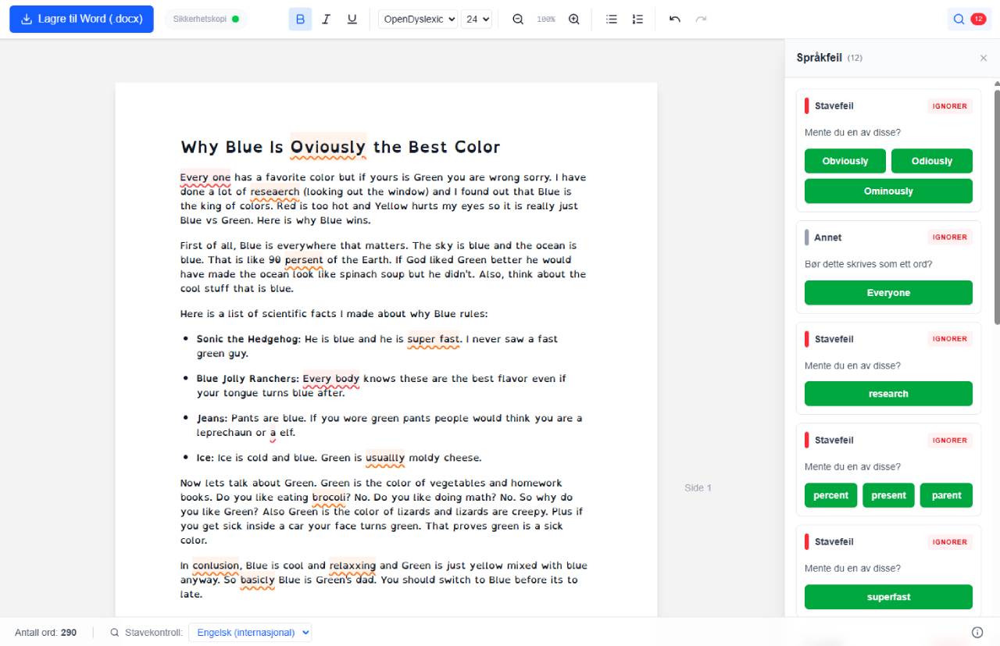

> [!WARNING]
> **Dette prosjektet er under utvikling (Work in Progress).**
> Det er ikke grundig testet ennå og kan inneholde feil som kan føre til tap av data. Bruk på eget ansvar.

[English version (README.en.md)](README.en.md) | [Spørsmål og svar](QA.md)

# Vestby prøve 📝

Vestby prøve er et minimalistisk, sikkert og "dumt" skriveverktøy designet spesifikt for bruk under prøver. Verktøyet er bygget for å være enkelt å hviteliste i **Safe Exam Browser (SEB)** og eliminerer risikoen for samarbeid.

## Hvorfor bruke Vestby prøve?

*   **Ingen innlogging:** Elevene trenger ikke Office 365-konto eller annen pålogging.
*   **Sikkert mot juks:** Ingen innebygde delingsfunksjoner eller muligheter for sanntidsredigering (co-authoring).
*   **GDPR-vennlig:** Ingen tekst eller personopplysninger du skriver her sendes til eller lagres på en server.
*   **Krasjsikring:** Teksten lagres automatisk og kontinuerlig i nettleserens minne (localStorage). Hvis PC-en går tom for strøm eller SEB krasjer, er teksten der når de åpner siden igjen. (Sikrer mot krasj eller tomt batteri).
*   **Universell utforming:** Inkluderer **OpenDyslexic** som standard font for å hjelpe elever med dysleksi.

## Funksjoner

*   Enkel tekstbehandling (Fet, Kursiv, Understrek, Overskrifter).
*   Fast linjeavstand på 1.5 (standard for skoleoppgaver).
*   Valg mellom OpenDyslexic, Arial og Verdana.
*   Ordtelling i sanntid.
*   Eksport til standard docx- og pdf-format
*   Innebygd stavekontroll for både **norsk (bokmål)** og **engelsk**.

## Teknisk info & Personvern (GDPR)

Dette er en **Zero-Knowledge** applikasjon. 

1.  **Serveren (Firebase Hosting)** leverer kun koden (HTML/JS/CSS) til elevens maskin.
2.  **All tekst** som skrives, behandles og lagres kun i elevens egen nettleser.
3.  **Eksporten** til Word/PDF skjer lokalt på maskinen.
4.  Ingen databaser, ingen sporing, ingen informasjonskapsler (cookies) fra tredjeparter.

## Lisens, tredjepartsprogramvare og kostnader

Dette prosjektet er åpen kildekode og lisensiert under [MIT-lisensen](LICENSE). Du kan derfor fritt klone prosjektet og hoste det selv. Den innebygde stavekontrollen krever at hver bruker laster ned omtrent 10 MB med data fra serveren din. Serveren din må derfor ha en datakvote som støtter dette, noe som kan koste penger.

Vi benytter oss av følgende tredjepartsprogramvare:
*   [Harper](https://github.com/elijah-potter/harper) (Apache License 2.0) - Brukes til lokal stavekontroll og grammatikk.

Se [CREDITS.md](CREDITS.md) for fullstendige lisensvilkår for tredjepartskomponenter.

## Veien videre (TODO)

*   **Testing:** Teste applikasjonen grundig i Safe Exam Browser (SEB).
*   **Refaktorering:** Splitte opp `App.tsx` i mindre, mer håndterbare komponenter.
*   **Språklig presisjon:** Når man lagrer en docx-fil bør den si at filen ble lagret i det det faktisk blir lagret. Den bør også si at filen ble lagret på datamaskinen, og ikke "i nedlastingsmappen din"

---

